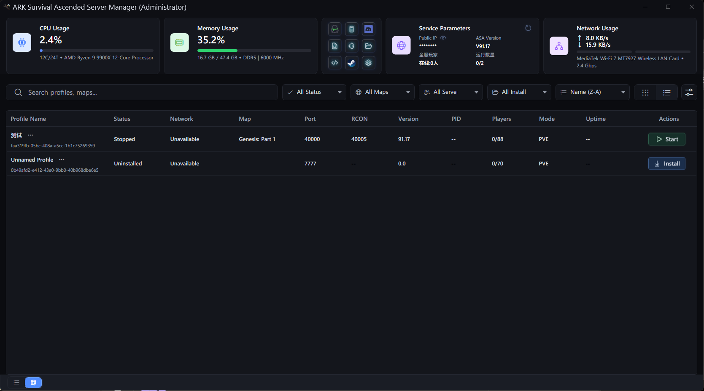
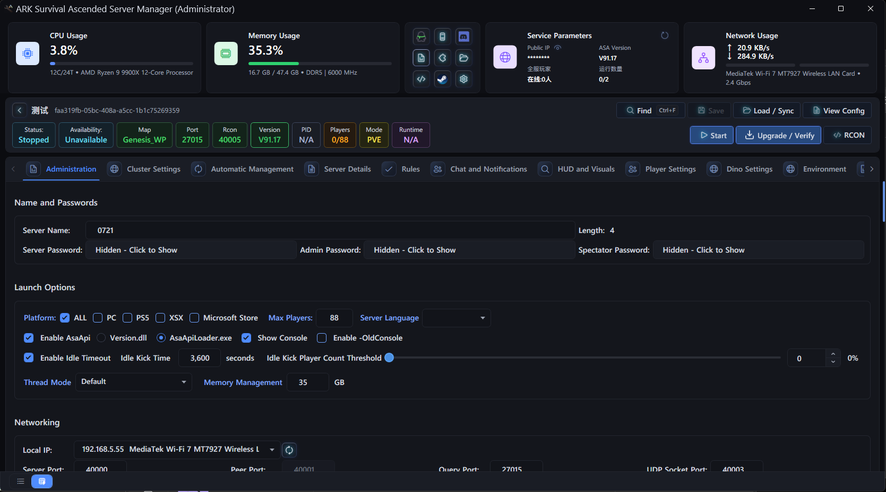
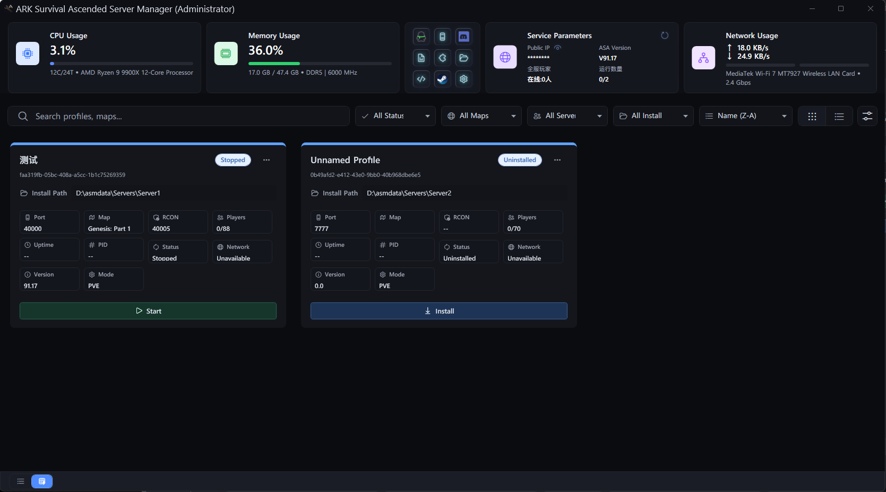

# ASA Server Manager
### Ark: Survival Ascended Server Management Tool

A brand-new Ark Survival Ascension server manager with a modern interface, complete server parameters and rich functions.

---

## ✨ Features

- **Modern UI Design** - Clean, intuitive interface with dark mode support
- **Full Server Configuration** - Complete control over all server parameters, settings and ini files
- **One-click Server Startup** - Launch, restart and stop servers with a single click
- **Mod Management** - Browse, install and update mods directly from CurseForge
- **Auto Backup System** - Scheduled world saves and automatic backup rotation
- **Multi-server Support** - Manage multiple server instances in one application
- **Real-time Console** - Live server log output with search and filtering
- **Player Management** - Online player list, ban/whitelist controls

---

## 🖼️ Screenshots

> Upload your screenshot files to this repository, then replace the filenames below.

---

## 📥 Download

Latest Release: Coming Soon

- Windows x64: [Download Link]
- System Requirements: Windows 10/11, .NET 8 Runtime
